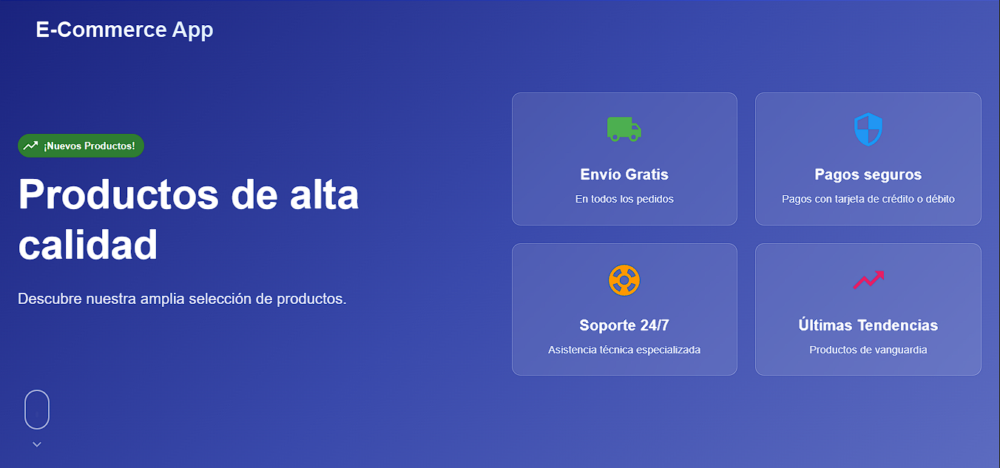
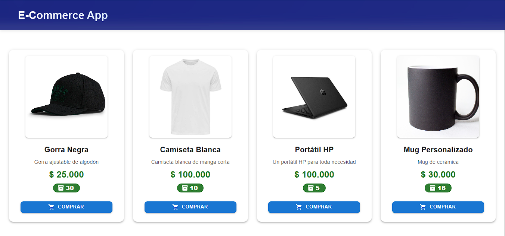
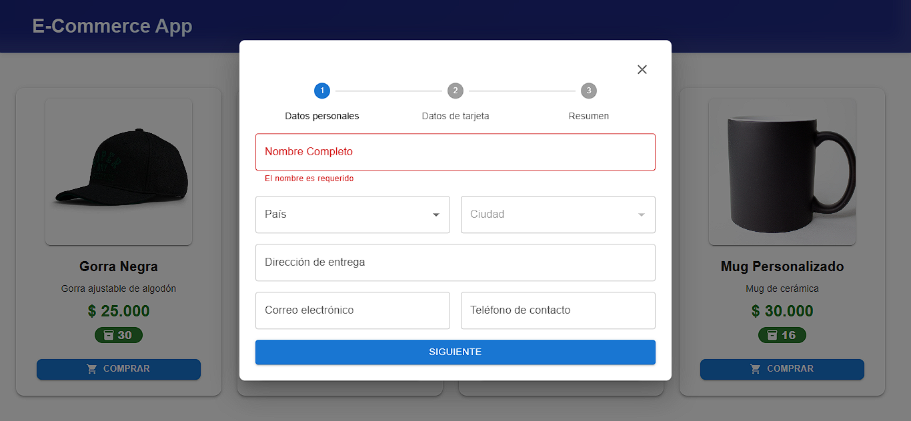
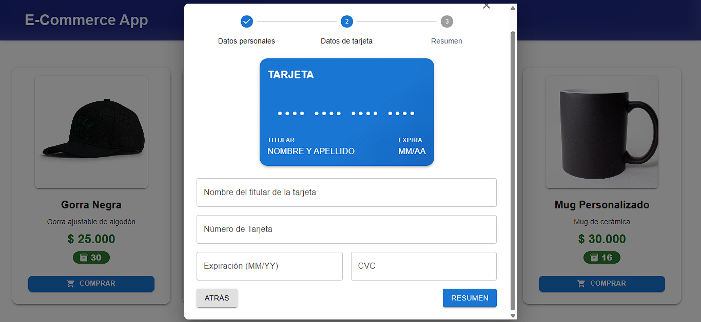
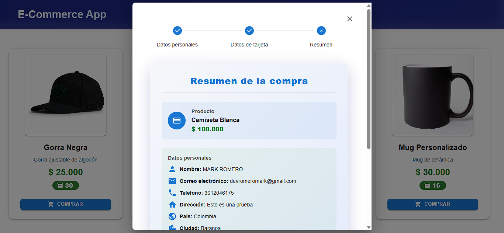
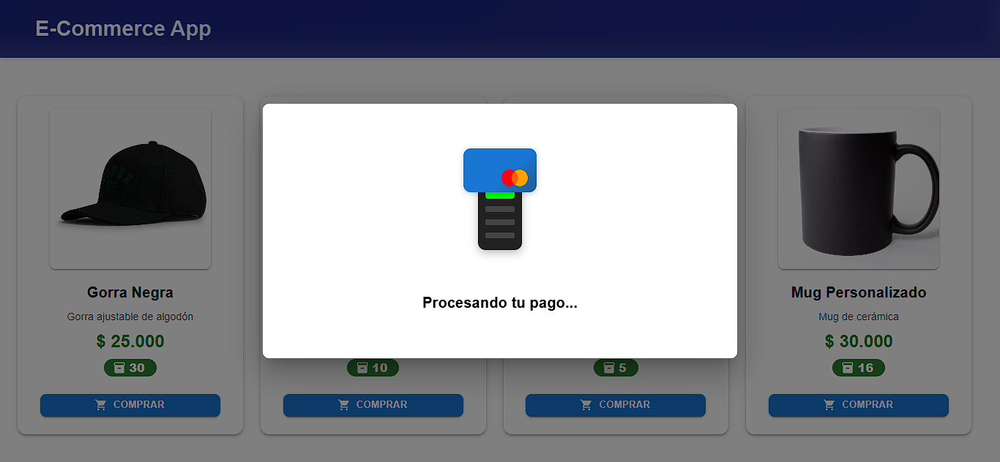
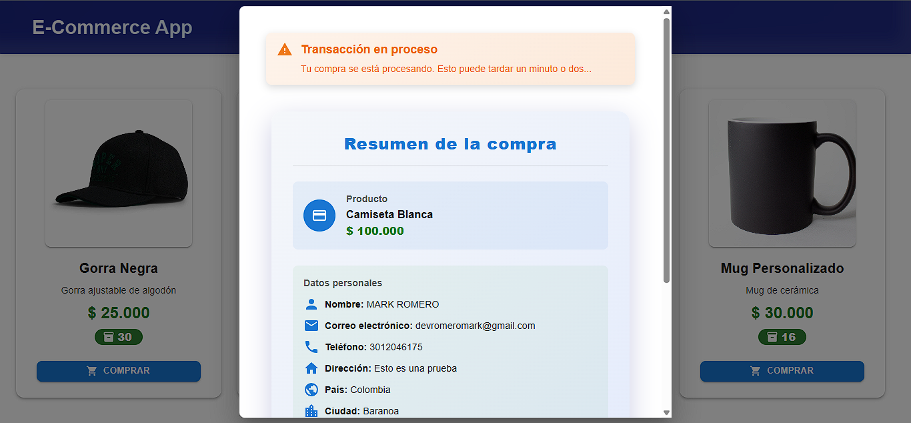
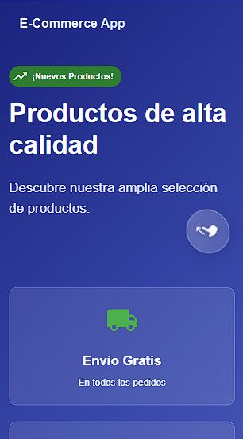
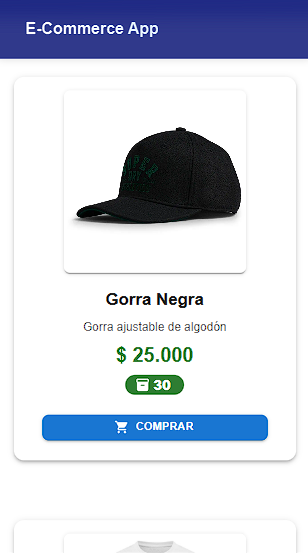
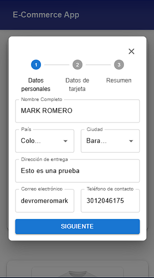

# 🛒 Ecommerce Web ReactJS

Una aplicación web de comercio electrónico moderna construida con React, TypeScript y Material-UI. Permite a los usuarios explorar productos, completar compras con un formulario de pago paso a paso y gestionar transacciones de forma segura.

## 📸 Capturas de Pantalla

### 🖥️ Versión Desktop















### 📱 Versión Móvil








## ✨ Características Principales

### 🎯 Funcionalidades del Usuario
- **Catálogo de Productos**: Visualización de productos con imágenes, precios y descripciones
- **Formulario de Pago Inteligente**: Proceso de compra en 3 pasos con validación en tiempo real
- **Persistencia de Datos**: Los datos del formulario se guardan automáticamente y se restauran al recargar la página
- **Validación Avanzada**: Validación de campos con mensajes de error personalizados
- **Animaciones de Procesamiento**: Indicadores visuales durante el procesamiento de pagos
- **Interfaz Responsiva**: Diseño adaptativo para dispositivos móviles y de escritorio

### 🔧 Funcionalidades Técnicas
- **Gestión de Estado**: Redux Toolkit para manejo centralizado del estado
- **Formularios Inteligentes**: Formik + Yup para validación y gestión de formularios
- **Persistencia Local**: localStorage para guardar datos del formulario
- **API REST**: Integración con backend para productos y transacciones
- **TypeScript**: Tipado estático para mayor seguridad y desarrollo eficiente
- **Tests Unitarios**: Jest y React Testing Library para testing completo

## 🛠️ Tecnologías Utilizadas

### Frontend
- **React 19.1.0** - Biblioteca de interfaz de usuario
- **TypeScript 5.8.3** - Tipado estático
- **Material-UI 7.2.0** - Componentes de UI
- **Redux Toolkit 2.8.2** - Gestión de estado
- **Formik 2.4.6** - Gestión de formularios
- **Yup 1.6.1** - Validación de esquemas
- **Axios 1.10.0** - Cliente HTTP

### Testing
- **Jest** - Framework de testing
- **React Testing Library** - Testing de componentes React
- **@testing-library/jest-dom** - Matchers adicionales para DOM
- **ts-jest** - Soporte para TypeScript en tests

### Herramientas de Desarrollo
- **Vite 7.0.4** - Bundler y servidor de desarrollo
- **ESLint 9.30.1** - Linting de código
- **React Hooks** - Hooks personalizados para lógica reutilizable

## 📁 Estructura del Proyecto

```
ecommerce-web-reactjs/
├── src/
│   ├── components/           # Componentes reutilizables
│   │   ├── __tests__/       # Tests de componentes
│   │   ├── form-steps/      # Pasos del formulario de pago
│   │   ├── CreditCardForm.tsx
│   │   ├── CreditCardModal.tsx
│   │   ├── ProductCard.tsx
│   │   └── ...
│   ├── features/            # Slices de Redux por funcionalidad
│   │   ├── __tests__/       # Tests de slices
│   │   ├── form/           # Gestión del formulario
│   │   ├── products/       # Gestión de productos
│   │   ├── transaction/    # Gestión de transacciones
│   │   ├── location/       # Gestión de ubicaciones
│   │   └── ui/             # Estado de la interfaz
│   ├── hooks/              # Hooks personalizados
│   │   └── __tests__/      # Tests de hooks
│   ├── utils/              # Utilidades y helpers
│   │   └── __tests__/      # Tests de utilidades
│   ├── page/               # Páginas principales
│   ├── redux/              # Configuración de Redux
│   ├── types/              # Tipos de TypeScript
│   └── main.tsx           # Punto de entrada
├── screenshots/            # Capturas de pantalla
├── public/                 # Archivos estáticos
└── package.json
```

## 🚀 Instalación y Configuración

### Prerrequisitos
- **Node.js** (versión 18 o superior)
- **npm** o **yarn**

### Pasos de Instalación

1. **Clonar el repositorio**
   ```bash
   git clone <url-del-repositorio>
   cd ecommerce-web-reactjs
   ```

2. **Instalar dependencias**
   ```bash
   npm install
   ```

3. **Configurar variables de entorno**
   
   Crea un archivo `.env` en la raíz del proyecto:
   ```env
   VITE_API_BASE_URL=http://localhost:3000/api
   ```

4. **Ejecutar en modo desarrollo**
   ```bash
   npm run dev
   ```

5. **Abrir en el navegador**
   
   La aplicación estará disponible en: `http://localhost:5173`

### Scripts Disponibles

```bash
# Desarrollo
npm run dev          # Inicia el servidor de desarrollo

# Producción
npm run build        # Construye la aplicación para producción
npm run preview      # Previsualiza la build de producción

# Testing
npm test             # Ejecuta todos los tests
npm run test:watch   # Ejecuta tests en modo watch
npm run test:coverage # Ejecuta tests con reporte de cobertura

# Linting
npm run lint         # Ejecuta ESLint para verificar el código
```

## 🧪 Testing

El proyecto incluye un sistema completo de tests unitarios implementado con Jest y React Testing Library.

### Tests Implementados

- ✅ **Tests de Redux Slices**: Estados y acciones de UI (4/4 tests pasando)
- ✅ **Tests de Hooks**: Verificación de existencia de archivos (1/1 test pasando)
- ✅ **Tests de Utilidades**: Funciones de formateo y validación (3/3 tests pasando)
- ✅ **Tests de Componentes**: Renderizado e interacciones (3/3 tests pasando)
- ✅ **Tests de Productos**: Verificación de existencia de archivos (1/1 test pasando)

### Ejecutar Tests

```bash
# Todos los tests
npm test

# Tests específicos
npm test src/features/ui/__tests__/uiSlice.test.ts

# Con cobertura
npm run test:coverage
```

## 🔧 Backend

Ver el repositorio https://github.com/MarkJrRomero/ecommerce-api-nestjs